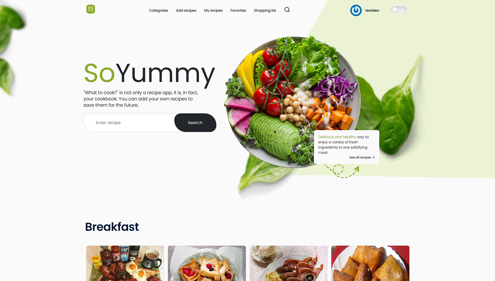
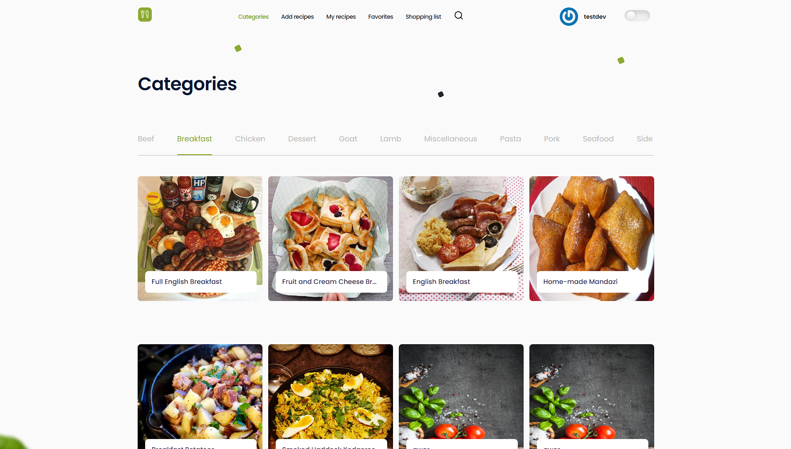
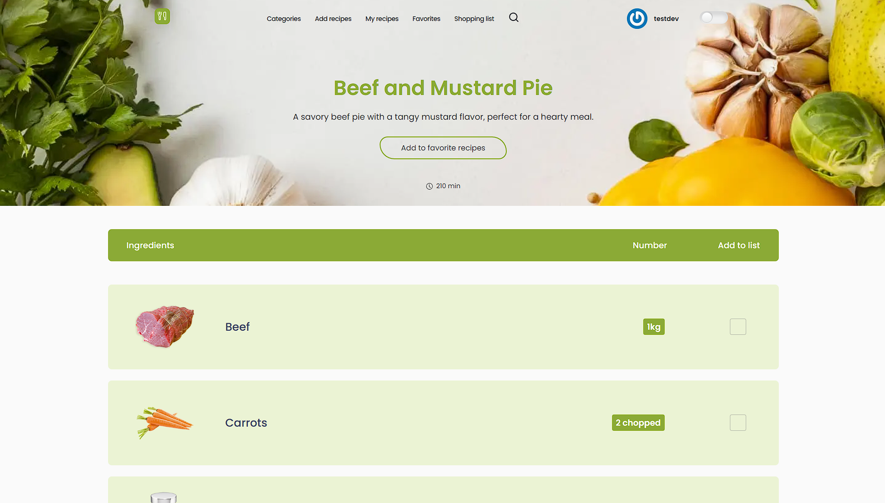
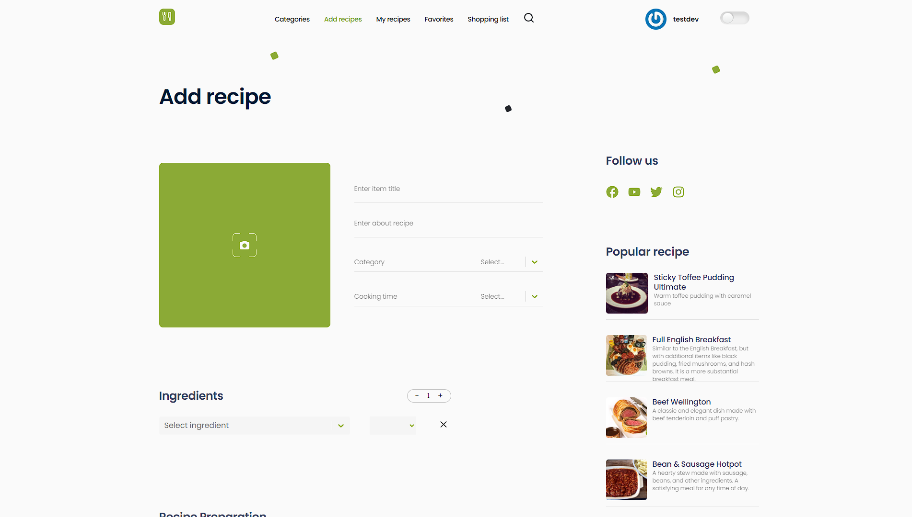
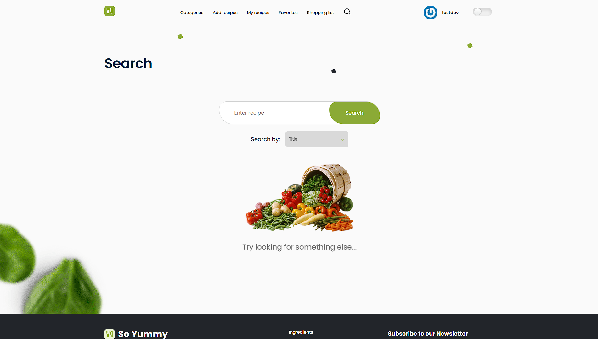

# So Yummy

Welcome to So Yummy! This web application provides a database of delicious
recipes, allowing users to search for recipes, create a user profile, add
recipes to the database, save favorite recipes, and generate a shopping list
based on recipe ingredients.

## Project Description

So Yummy is designed to help users discover and prepare various dishes easily.
It offers a vast collection of recipes across different cuisines, including
appetizers, main courses, desserts, and more. Users can search for recipes by
title or ingredients.

By creating a user profile, users can save their favorite recipes and access
them later. Additionally, users can contribute to the recipe database by adding
their own recipes.

## Usage

1. Upon launching the app, you'll land on the welcome page of So Yummy, where
   you can either register as a new user or sign in if you already have an
   account.
2. To register, click on the "Register" button and provide the required
   information, such as username and password.
3. If you already have an account, click on the "Sign In" button and enter your
   credentials to access your user profile.
4. Once signed in, you can search for recipes by using the search bar at the top
   of the page. Enter the recipe title or ingredients you desire and click
   "Search" to see the results.
5. To add a recipe to the database, click on the "Add Recipe" button and provide
   the necessary details such as title, ingredients, instructions, and any
   additional information.
6. To save a recipe to your favorites, click the "Save" button on the recipe
   card.
7. To generate a shopping list, go to the "My Favorites" page and select the
   desired recipes. Then click on the "Generate Shopping List" button, which
   will compile all the necessary ingredients for your selected recipes.
8. You can view and manage your shopping list from the "My Shopping List" page.
   Mark items as purchased or remove them as needed.

## Project Tasks

- Development Timeline: 2 weeks
- Design Mockup:
  [Figma](https://www.figma.com/file/rj6kSC63HyaVsHXqMtt3Cv/So-Yummy?type=design&node-id=0-1&mode=design)
- Backend Repository: [GitHub](https://github.com/natalynoele/yummy-backend)
- Swagger Documentation:
  [Swagger Docs](https://yummy-service.onrender.com/api-docs/#/)

## Project Team

The So Yummy project is developed by the following team members:

1. [Anastasiia2302](https://github.com/Anastasiia2302)
2. [AnastasiiaBakumenko](https://github.com/AnastasiiaBakumenko)
3. [BaristaYaroslv](https://github.com/BaristaYaroslv)
4. [Dimar95](https://github.com/Dimar95)
5. [Kryzhanivskyi89](https://github.com/Kryzhanivskyi89)
6. [NVZ1994](https://github.com/NVZ1994)
7. [Umberban](https://github.com/Umberban)
8. [Vastasika](https://github.com/Vastasika)
9. [VladDyadenko](https://github.com/VladDyadenko)
10. [Yanna-Trofimova](https://github.com/Yanna-Trofimova)
11. [natalynoele](https://github.com/natalynoele)
12. [vitalij99](https://github.com/vitalij99)
13. [webdevbiv](https://github.com/webdevbiv)

Feel free to reach out to any team member if you have questions or need
assistance with the project.

## Technologies and Dependencies Used

- **React**: A JavaScript library for building user interfaces.
- **Redux Toolkit**: A package for efficient Redux development.
- **React Router DOM**: Library for routing in React applications.
- **Axios**: A promise-based HTTP client for making API requests.
- **Formik**: A form library for handling form validation and submission.
- **Yup**: A JavaScript schema validation library.
- **Styled Components**: A CSS-in-JS library for styling React components.
- **React Icons**: A library for including popular icon sets in React projects.
- **React Loader Spinner**: A library for displaying loading spinners in React
  applications.
- **React Select**: A library for creating custom select inputs in React.
- **Redux Persist**: A library for persisting Redux state in local storage.
- **Notiflix**: A library for displaying notifications and alerts in React
  applications.
- **Normalize.css**: A CSS file that makes browser styles consistent across
  different browsers.
- **React Scripts**: A package with scripts and configuration used by Create
  React App.
- **Babel Plugin Styled Components**: A Babel plugin for better styled
  components performance.

## Screenshots

Here are some screenshots of the So Yummy app:

